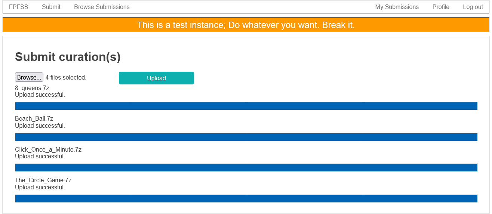
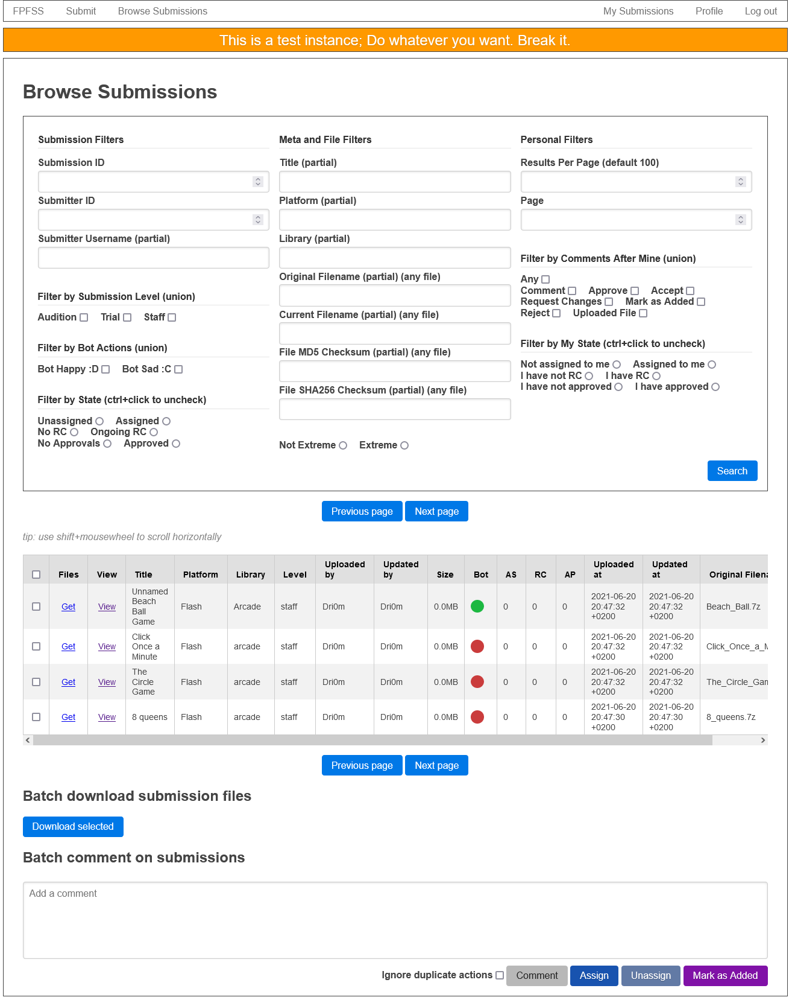
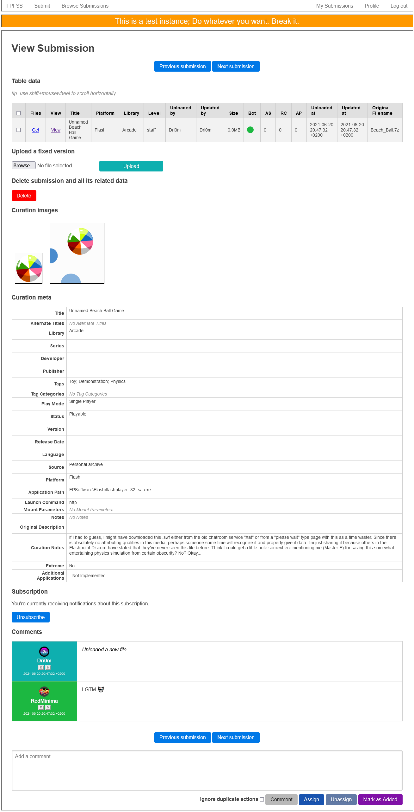
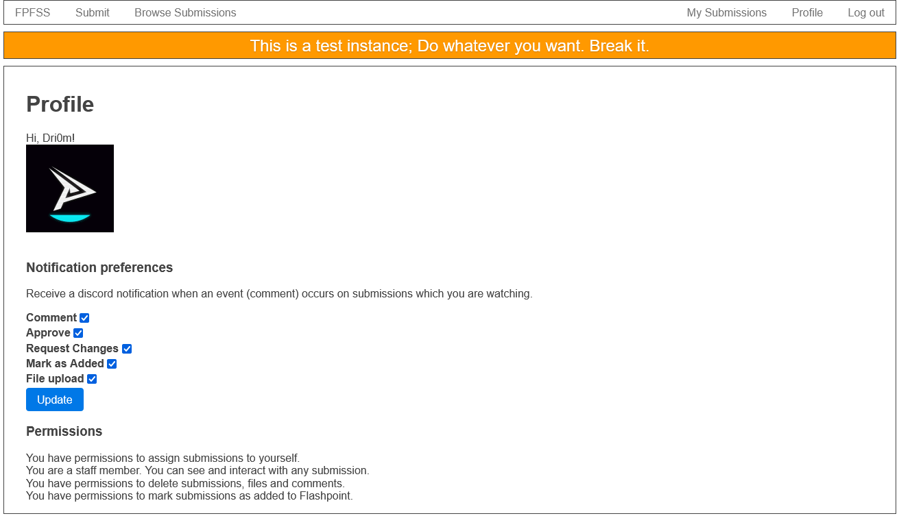

# flashpoint-submission-system

it's a thing, and it's pretty WIP

it will be a submission management system for https://bluemaxima.org/flashpoint/ or something

## How to run this thing

- it's using discord for user auth, so you need a discord app with oauth config
- set up a discord bot to read user roles (FYI roles are hardcoded for Flashpoint discord server), roles are used for
  permission inside the system
- set up a discord bot to post notifications, can be the same bot as the previous one
- start a mysql instance, `make db` will do the work for you if you're a fan docker-compose
- start a curation validator server https://github.com/FlashpointProject/Curation-Validation-Bot (make command available
  in this repo)
- start an archive indexer if you want to upload stuff to
  flashfreeze https://github.com/Dri0m/recursive-archive-indexer (make command available in this repo)
- fill in all the stuff in .env (which is complex and needs more description here, yea)
- start the thing using `go run ./main/*.go`

## TODO stuff

- tests are definitely broken and need some love
- redundant code and code weirdness is present to remind you that you shouldn't code like this

it looks something like this

and this

and this

and also this

